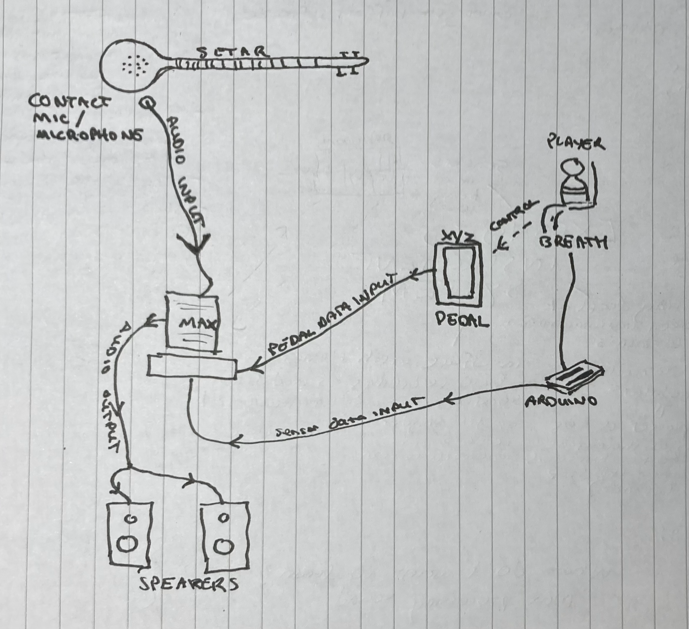
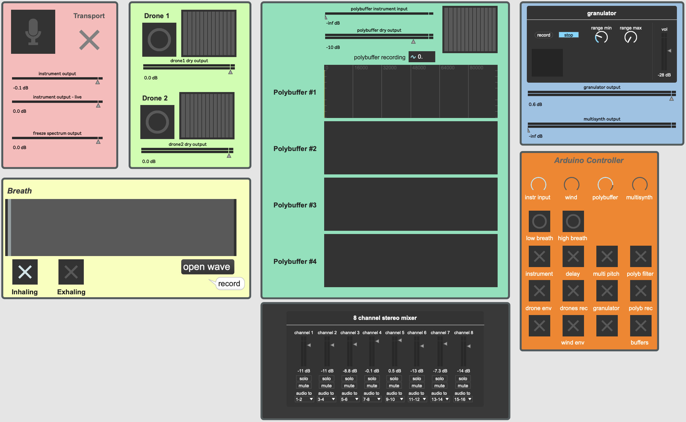

Inspired by my recent explorations of Pauline Oliveros's _Expanded Instrument System_ (EIS)[^oliveros2007], I set out to develop a hybrid system to accompany instrumental improvisations, using the performer's breath cycles to control its parameters. An EIS is:

> I understood the Expanded Instrument System to mean "time machine" – what is expanded is temporal - present/past/future is occurring simultaneously with transformations. What I play in the present comes back in the future while I am still playing, is transformed and becomes a part of the past. This situation keeps you busy listening.

<cite>Pauline Oliveros</cite>

In this post, I outline the concept, provide an overview of my design and development process, and share my reflections on the outcome. Additional details on the technical implementation will be provided in subsequent posts, including code to replicate this EIS.

## Concept

From the outset, I envisioned this EIS to function as an extension of the performer — both as a controller and audio processor; however, rather than relying on conventional means such as the use of a foot pedal, I wanted the natural act of the performer's breath cycles to serve as this extension. I developed a system through which the performer can control aspects of their improvised performance by inhaling and exhaling, culminating in a reimagined textural rendition of their performance to which they can respond. In this way, the performer sits at the intersection of attunement to their breath as a source of control, and unconscious submission to its natural cycles as a source of chaos.

Expanding on the idea of the performer's response to these reprocessed sounds, I introduced elements of randomness to counterbalance their control and intention over the performance, encouraging openings for the performer to change their direction at any given moment. The final result of which I believe conveys my original goal — to create the foundation for a dynamic composition that maintains a balance between spontaneity and control as the performance unfolds.

## Design

This project consists of four primary elements:

* A stringed instrument — I selected the Persian Setar for its drone-like characteristics and is well-suited for improvisation.
* Breath control sensor as a control source for MaxMSP's reprocessed audio. Inspired by Ben Finio's Arduino breath controller.[^finio2024]
* A control box to transmit data between the sensor and MaxMSP - I built an AdaFruit UNTZtrument[^untztrument] for this purpose as the 3D print templates, code, and build-of-materials were readily available.
* MaxMSP patch for processing audio received by the instrument.

*Early design diagram*

1. Audio output from the instrument is sent to MaxMSP via a microphone.
2. Arduino captures output from the player's breath control sensor.
3. Arduino outputs processed data from the sensor into MaxMSP.
4. MaxMSP processes audio and sends its output to stereo speakers.

_Initially I had intended to introduce a foot controller to capture audio and modulate MaxMSP's reprocessed audio; however, in the interest of simplicity and emphasising breathing as the core dynamic, I decided to leave it out._

## Development

### Hardware

I aimed to remove reliance on direct computer interaction as a means to control the EIS as I believe it detracts from the artistic intent, whereby breath cycles control the outcome of the performance. I therefore opted to assemble an Arduino controller that allows set parameters to be changed throughout the performance. I created an Adafruit "Mini Untztrument" to achieve this; however, I needed to make modifications to the code to allow two-way communication between the controller and MaxMSP, as well as adding circuitry to support the breath sensor.

*Arduino breath sensor*

The breath sensor was relatively easy to construct, though I experienced difficulty with the sensor values decreasing too quickly due to the nature of the conductive rubber that acts as a resistor — I was able to circumvent this issue by smoothing the sensor's values in MaxMSP. I also needed a way to implement a visual representation of my breath on the controller, so I wrote some code to change the brightness of the NeoTrellis grid relative to the incoming sensor values.

### Software

Using MaxMSP presented a steep learning curve for me; however, it was made easier due to the amount of learning resources available both in the application and online. Through my EIS, I became familiar with many new concepts: multichannel polybuffers, spectral processing, pitch detection, and controlling parameters with external sensor values.

Discovering various modules from the "Upshot"[^upshot] package such as reverbs, delays, and probability gates, helped me to circumvent the finer intricacies that I feel would've otherwise slowed my progress towards achieving my overarching goal. 

*MaxMSP user interface*

Refining the patch relative to my performance objectives was the most difficult aspect in developing my EIS as it involved aligning the technical components of my composition with my desired artistic outcomes. The process required multiple revisions of the modules — I found myself dedicating more time to testing my EIS, reconsidering how the modules work together in a performance setting and making many minor, yet impactful adjustments.

### Performance

During the earlier phases of development, I was dissatisfied by the performative aspects of my EIS — it sounded good, yet it lacked forward movement and dynamics. At this stage, sound processing consisted of multiple drones being recording to buffers triggered by the performer's inhalations. I decided on the addition of a four-channel polybuffer that can be recorded to separately from the drones. I also applied additional processing such as time-stretching. Finally, I experimented with synthesis through multichannel processing. In this approach, the pitch of each saw-wave channel is determined by frequencies detected through the instrument's input using pitch detection. As my instrument is capable of quarter-tones, I was unable to use MaxMSP's in-built MIDI conversion functions, so I devised a way to obtain the most frequently detected note within a period of two seconds from the spectral freeze capture, triggered by the performer's inhalation. This allows the performer to play a sequence of notes with breath cycles in-between, which are then replicated as a saw waves across each of the four channels.

I'm pleased with this approach as it offered further opportunities to utilise breath as a means of control, and the performance now consists of four main elements that can be played independently and combined: improvisation of the instrument, underlying drones, melodic echoes facilitated by polybuffers, and synthesis determined by the notes being played. With an aim to introduce further dynamics into the performance. I integrated some low-frequency oscillators — modulated by the breath, to affect each modules' parameters such as filter cutoff and resonance.

Finally, given the limited duration of the performance I needed a way to signal the performer about the time without diverting their attention away from the performance. I addressed this by integrating filter-sweep of noise occurring every two minutes throughout the performance, that can also be modulated through an LFO controlled by breath. The performer may use this audible indicator as a pattern-breaker, offering a further opportunity to the direction of their performance.

[^oliveros2007]: **Oliveros, Pauline.** "[The Expanded Instrument System (EIS): An Introduction and Brief History.](http://cycling74-web-uploads.s3.amazonaws.com/654eb437deb212469f7c3e6f/2023-11-29T11:27:19Z/The_Expanded_Instrument_System_Recent_De.pdf)" Future of Creative Technologies, Journal of the Institute of Creative Technologies 1 (2008): 21-24.

[^finio2024]: **Finio, Ben.** "Can You Train People to Breathe Better?" Science Buddies, February 13, 2024. [https://www.sciencebuddies.org/science-fair-projects/project-ideas/HumBio_p055/human-biology-health/train-belly-breathing](https://www.sciencebuddies.org/science-fair-projects/project-ideas/HumBio_p055/human-biology-health/train-belly-breathing).
[^untztrument]: **Burgess, Phillip.** "UNTZtrument: A Trellis MIDI Instrument." AdaFruit Industries. June 20, 2014.
    * [https://learn.adafruit.com/untztrument-trellis-midi-instrument?view=all](https://learn.adafruit.com/untztrument-trellis-midi-instrument?view=all)
    * [https://cdn-learn.adafruit.com/downloads/pdf/untztrument-trellis-midi-instrument.pdf](https://cdn-learn.adafruit.com/downloads/pdf/untztrument-trellis-midi-instrument.pdf).
[^upshot]: **Van Esser, Benjamin**. "Upshot". January 28, 2020. [http://www.benjaminvanesser.be/software/max.html](http://www.benjaminvanesser.be/software/max.html).